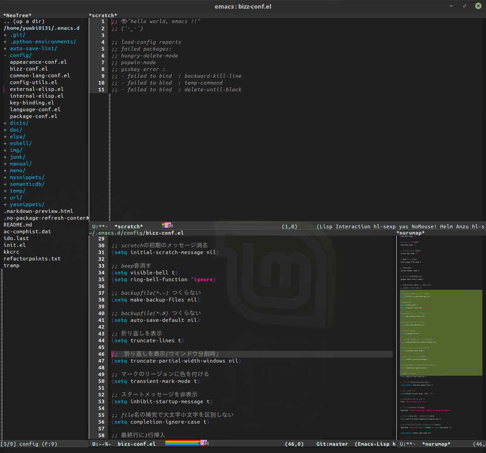

# 自分用 ~/.emacs.d

修正中 & 未確認 (´・_・`)

以下イメージ



修正して使う.
設定など.
```
$ git clone https://github.com/yuwki0131/emacs.d
$ mv emacs.d ~/.emacs.d
```
※要use-package

## elispファイル構成

~/.emacs.d/configディレクトリ以下

|el file|設定|
|:-------------|:------------------------------------------------------|
| package-cnof | 外部パッケージ(elpaからパッケージ要取得)の設定項目 |
| bizz-cnof | emacsデフォルト(elpaからパッケージの取得が不要)の設定項目 |
| appearance-cnof | bizzに引続き、emacsデフォルトの外見設定 |
| common-lang-cnof | 言語共通設定 or 複数言語に共通する設定(要elpaの設定) |
| language-cnof | 特定の言語設定、1言語ごとの設定 |
| external-eslip | 外部から持ち込んだコードなど |
| internal-eslip | 自作したコード |
| key-binding | キーバインドは一括してここにまとめる |
## キーバインド

デフォルト以外のglobal-set-key設定

|分類1|分類2|キー|関数名|内容|
| -------- |:----|:-------- | -------------------- |:-------|
