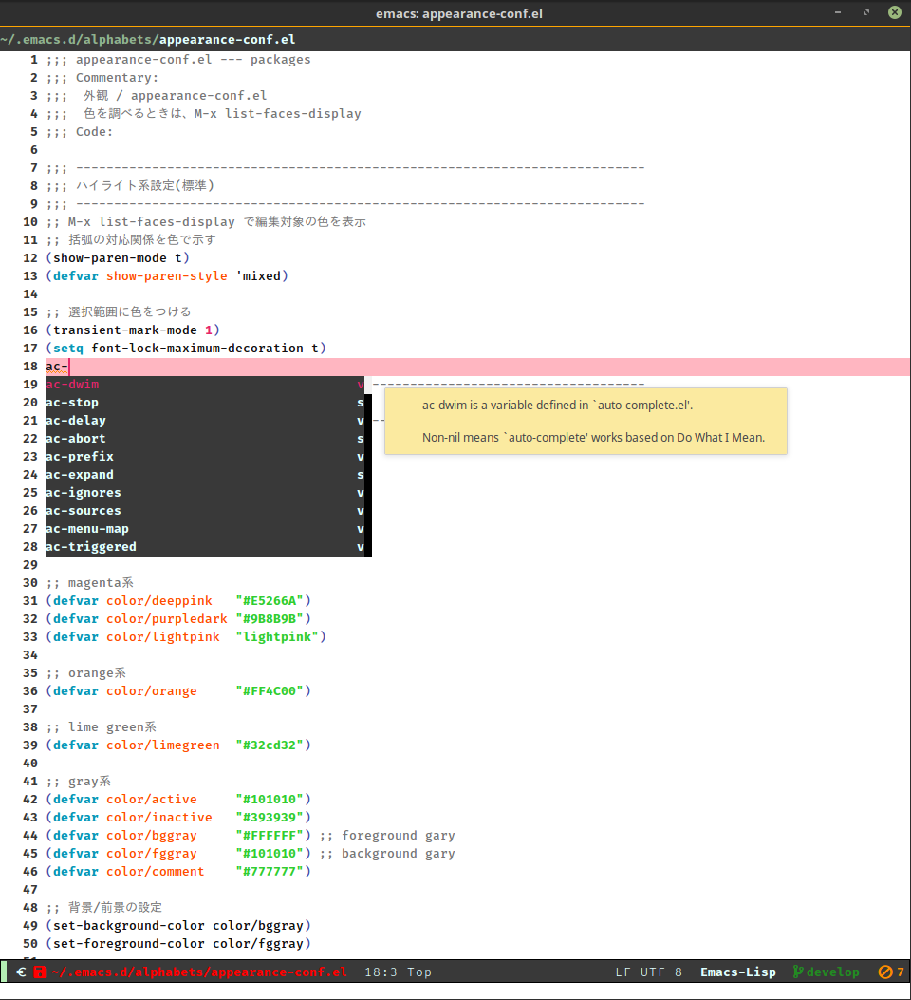

# 自分用 ~/.emacs.d

* 修正中 & 未確認 (´･_･`)

* 修正して使うこと。

* READMEですがメモです。

* Linux Mint用

## スクリーンショット



## ~/.emacs.d/configディレクトリ以下構成

### elispファイル構成

| | *.elファイル |use-package|設定|
|:---:|:------------------|:-:|:------------------------------------------------------------|
| A | appearance-conf     | - | emacsデフォルトの外見設定 |
| B | builtin-conf        | - | emacsデフォルトの設定項目 |
| C | common-lang-conf    | o | 言語共通設定 or 複数言語に共通する設定 |
| D | display-package-conf| o | 表示系パッケージの設定項目 |
| E | edit-package-conf   | o | 編集系パッケージの設定項目 |
| F | font-conf           | - | フォント設定 |
| K | key-binding         | - | Globalなキーバインドはここに一括 |
| L | language-conf       | o | 各言語設定 |
| M | modeline-conf       | - | モードライン設定 |
| O | outsider-eslip      | - | 外部から持ち込んだコード |
| P | package-conf        | o | 各パッケージの設定項目 |
| S | search-package-conf | o | 検索系パッケージの設定項目 |
| T | tips-eslip          | - | 雑多な追加機能のコード |
| U | util-elisp          | - | configファイル用のユーティリティ |

* 順不同
* 残り(G, H, I, J, N, Q, R, V, W, X, Y, Z)

## 設定

```
$ git clone https://github.com/yuwki0131/emacs.d
$ mv emacs.d ~/.emacs.d
```

### 要use-package

* 自動で入れられない(?)ため

```
M-x package-install use-package
```

## elpaからpackage-install

初期化するとエラーレポートが出るので、以下のコマンドを実行。
不足しているelpaの最新版パッケージがインストールされる。

```
M-x install-complements
```

## byte-compile *.el files

`config/*.el`下のファイルを更新。

```
M-x refresh-byte-compile
```

## キーバインド

デフォルト以外のglobal-set-key設定

|分類1|分類2|キー|関数名|内容|
| -------- |:----|:-------- | -------------------- |:-------|
|prefix|解除|C-e|unbind|prefix keyに使用|
|prefix|解除|C-a|unbind|prefix keyに使用|
|prefix|解除|C-z|unbind|prefix keyに使用|
|prefix|解除|M-m|unbind|別用途のため解除|
|prefix|解除|M-j|unbind|別用途のため解除|
|機能||C-q|undo|undo & redo|
|機能||M-q|redo|undo & redo|
|編集|削除|C-h|delete-backward-char|Backspaceで削除 (文字単位/単語単位)|
|編集|削除|M-h|backward-kill-word|Backspaceで削除 (文字単位/単語単位)|
|編集|挿入|C-:|insert-underscore|アンダースコア挿入|
|編集|挿入|M-RET|yas-insert-snippet|snippet: yaスニペット挿入|
|編集|挿入|M-y|browse-kill-ring|kill-ringを表示|
|編集|置換|C-M-s|vr/isearch-forward|vr/isearch側の正規表現置換|
|編集|置換|C-M-r|vr/isearch-backward|vr/isearch側の正規表現置換|
|編集|括弧|C-l|insert-parenthesis|括弧挿入|
|編集|括弧|C-S-l|insert-angle-brackets|括弧挿入|
|編集|括弧|M-l|insert-brackets|括弧挿入|
|編集|括弧|M-S-l|insert-squares|括弧挿入|
|編集|改行|C-m|smart-newline|スマートな改行|
|移動|バッファ内|M-m|backward-paragraph|パラグラフ単位の移動|
|移動|バッファ内|M-p|scroll-up-in-place|1行スクロール(カーソル位置固定)|
|移動|バッファ内|M-n|scroll-down-in-place|1行スクロール(カーソル位置固定)|
|移動|バッファ内|M-g|goto-line|指定行へ移動(1回でgoto-line)|
|移動|バッファ内|M-a|ace-jump-mode|ace jump mode|
|移動|バッファ内|C-,|goto-next-TODO|次のTODOへ移動|
|移動|バッファ内|C-.|goto-next-locus|次のエラー(警告)へ移動|
|移動|バッファ内|C-?|highlight-symbol-next|シンボル単位移動|
|移動|バッファ内|C-!|highlight-symbol-prev|シンボル単位移動|
|移動|バッファ間|M-o|other-window|別フレームへ移動|
|移動|バッファ間|C-M-f|next-buffer-with-skip*|バッファ移動 (*付バッファはスキップ)|
|移動|バッファ間|C-M-p|previous-buffer-with-skip*|バッファ移動 (*付バッファはスキップ)|
|その他|その他|C-S-+|text-scale-increase|文字の拡大/縮小|
|その他|その他|C-S--|text-scale-decrease|文字の拡大/縮小|
|その他|その他|C-+|increment-number|数値のインクリメント/デクリメント|
|その他|その他|C--|decrement-number|数値のインクリメント/デクリメント|
|その他|その他|M-j|temp-command|一時的なコマンド束縛用(テスト用/試用)|
|機能||C-z p|toggle-truncate-lines|enable/disable toggle-truncate-line|
|機能||C-z C-k|kill-the-other-buffers|現在のバッファ以外のバッファを閉じる|
|機能||C-z f|set-file-name-coding-system|エンコーディングを変更|
|機能||C-z C-z|zsnotes-open-today-note|インスタント・メモファイルを開く|
|機能||C-z C-j|open-junk-file|ジャンクファイルを作成、開く|
|機能||C-z C-p|shell-pop|shell-popを表示/非表示|
|機能|置換|C-z C-r|replace-string|文字列置換|
|機能|検索|C-z C-b|grep-this|grep this: バッファ内Grep|
|機能|検索|C-z C-f|grep-find-this|grep find this: ディレクトリ配下Grep|
|機能|検索|C-z C-s|swoop|swoop: バッファ内を動的検索/移動|
|機能|検索|C-z C-c|codic|codic: コーディング用辞書|
|機能|検索|C-z w|define-word|define-word: 英英辞典|
|機能|検索|C-z C-w|define-word-at-point|define-word: 英英辞典|
|機能|検索|C-z r|rgrep|rgrep: ディレクトリ内Grep|
|機能|検索|C-z g|google-this|google-this(Googleで検索)|
|機能|検索|C-z C-a|goto-address-at-point|現在のURLリンクを開く<br/>(goto-address-mode)|
|機能|検索|C-z i l|imenu-list-smart-toggle|imenu-list(関数定義一覧表示)|
|機能|検索|C-z i b|ibuffer|ibuffer(バッファ一覧表示)|
|機能|表示|C-z s|make-buffer-small|バッファのウィンドウサイズを縮小|
|機能|表示|C-z C-n|neotree-toggle|ディレクトリ階層を表示 (neo tree)|
|機能|表示|C-z m|magit-status|magit (Emacs Git)|
|機能|表示|C-z C-k|describe-bindings|キーバインド表示|
|機能|辞書|C-z C-d|search-dictionary-e2j-current-word|現在の単語の意味を表示(要辞書設定)|
|機能|辞書|C-z d|search-dictionary-e2j|英和辞典(要辞書設定)|
|機能|実行|C-z e|execute-current-shell-script|現在のディレクトリのxxx.sh実行|
|機能|日記|C-z l n|daily-notes-open-today-note|今日の日記を作成|
|機能|日記|C-z l o|daily-notes-open-default-file|既存の日記一覧を表示|
|機能|ブログ|C-z b n|quickblog-create-new-post|新しいブログポストを作成|
|機能|ブログ|C-z b o|quickblog-open-default-file|既存のブログポスト一覧を表示|
|機能|ブログ|C-z b r|quickblog-run-local-server|Cryogenをローカルで実行|
|編集||C-a C-a|comment-dwim|comment out/in|
|編集||C-a C-u|upcase-word|upcase/downcase word|
|編集||C-a C-p|downcase-word|upcase/downcase word|
|編集|削除|C-a C-c|kill-until-corresp-paren|括弧削除|
|編集|削除|C-a C-k|kill-this-buffer|現在のバッファを削除|
|編集|削除|C-a C-h|backward-kill-word|後ろ向きな単語削除|
|編集|削除|C-a C-f|merge2lines|行のマージ(インデント用などの空白削除) <br/> (不要かも)|
|編集|削除|C-a C-i|just-one-space|周囲の空白を削除し、単一の空白にする|
|編集|挿入|C-a C-q|quoted-insert|旧(C-q) 引用付き挿入(置換等で使用)|
|編集|挿入|C-a C-s|insert-shoborn|(´･_･`)を挿入|
|編集|挿入|C-a C-d|insert-date-normal|現在時刻挿入|
|編集|挿入|C-a M-d|insert-date-markdown|現在時刻挿入|
|編集|挿入|C-a C-e|insert-current-file-name|現在のファイルパスを挿入|
|編集|挿入|C-a C-m|insert--s|コメント用の線を挿入|
|編集|refactoring|C-a i|iedit-mode|iedit-mode: 同一のシンボルを同時置換|
|編集|その他|C-a C-r|rectangle-mark-mode|矩形選択|
|移動|バッファ内|C-e C-l|goto-last-change|最後の変更箇所へ|
|移動|バッファ内|C-e C-a|move-beginning-of-line|行頭/行末へ(unbindの再設定)|
|移動|バッファ内|C-e C-e|move-end-of-line|行頭/行末へ(unbindの再設定)|
|移動|バッファ内|C-e C-l|recenter-top-bottom|top-center-bottom間|
|移動|バッファ内|C-e C-l|imenu|imenu: 関数定義へ|
|移動|バッファ内|C-e C-s|swiper|swiper: バッファ内を動的検索/移動|
|移動|バッファ間|C-e C-c|shell|shell/repl/grepxへ|
|移動|バッファ間|C-e C-v|move-to-scratch|shell/repl/grepxへ|
|移動|バッファ間|C-e g|move-to-grep|shell/repl/grepxへ|
|移動|バッファ間|C-e C-w|move-to-repl|shell/repl/grepxへ|
|移動|バッファ間|C-e C-b|previous-buffer-with-skip*|次/前のバッファへ (*付バッファはスキップ)|
|移動|バッファ間|C-e C-f|next-buffer-with-skip*|次/前のバッファへ (*付バッファはスキップ)|
|移動|検索|C-e s|search-forward-regexp|正規表現検索 (通常)|
|移動|検索|C-e r|search-backward-regexp|正規表現検索 (通常)|
|移動|検索|C-e C-o|occur|正規表現検索 (一覧表示)|
|移動|検索|C-e C-r|replace-regexp|正規表現置換 (Emacs標準)|
|移動|検索|C-e C-j|dumb-jump-go|関数の定義位置に移動(dumb-jump)|
|移動|検索|C-e C-k|dumb-jump-back|関数の定義位置に移動(dumb-jump)|
|移動|検索|C-e C-n|highlight-symbol-next|次/前のシンボルの位置へ|
|移動|検索|C-e C-p|highlight-symbol-prev|次/前のシンボルの位置へ|
|移動|検索|C-e o|recentf-open-files|最近開いたファイルを開く|
|移動|Bookmark|C-e C-t|bm-toggle|現在行をブックマーク、ハイライト表示|
|移動|Bookmark|C-e C-i|bm-next|現在行をブックマーク、ハイライト表示|
|移動|Bookmark|C-e C-u|bm-previous|現在行をブックマーク、ハイライト表示|
|移動|Bookmark|C-e t|bm-show|現在行をブックマーク、ハイライト表示|
|移動|Bookmark|C-e M-t|bm-show-all|現在行をブックマーク、ハイライト表示|
